# GTX 1060 VFIO Passthrough Inference VM

<!-- CONSTITUTION_START -->
[](https://github.com/esanacore/engineering-constitution)
<!-- CONSTITUTION_END -->

Documentation, reference configs, and verification tooling for turning a
second, driver-incompatible GPU (GTX 1060) into a usable local-inference
box — without touching the host's primary GPU (RTX 4080) or its driver
branch.

**Host:** `Murderbot` — Ubuntu, RTX 4080 on the NVIDIA 595.x (current) driver
branch.
**Guest VM:** `art` (libvirt domain name `gtx1060-inference`) — Ubuntu, GTX
1060 passed through via VFIO, running Docker + nvidia-container-toolkit for
containerized local LLM inference.

## Who This Is For

Primarily an operational reference for this specific machine — the
authoritative record of how `Murderbot`/`art` are configured, so future
changes have a known-good baseline to diff against (see `scripts/`).
Secondarily, a worked example for anyone hitting the same underlying
problem: two NVIDIA GPUs on one host that each require a different,
mutually-incompatible driver branch.

## Project Structure

```text
.
├── README.md              # you are here — overview, diagram, quick reference
├── VERSION                 # current release version (single source of truth)
├── CHANGELOG.md            # user-facing changes by release
├── TODO.md                 # living roadmap / known follow-up work
├── docs/
│   ├── 01-diagnosis.md            # narrative: why the 1060 was invisible
│   ├── 02-host-vfio-setup.md      # narrative: host IOMMU/vfio-pci setup
│   ├── 03-vm-provisioning.md      # narrative: building the art VM
│   ├── 04-guest-driver-docker-gpu.md  # narrative: guest driver/Docker/toolkit
│   ├── 05-incident-ollama-crashloop.md # unrelated incident found + fixed
│   ├── 06-incident-wayland-gpu-hang.md # unrelated incident found + fixed
│   ├── adr/                       # architecture decision records
│   ├── ARCHITECTURE.md            # system overview + component diagram
│   ├── SETUP.md                   # governance-standard setup index
│   ├── OPERATIONS.md              # deployment/monitoring/incident response
│   ├── COMMAND_REFERENCE.md       # quick command lookup
│   ├── TROUBLESHOOTING.md         # known issues and fixes
│   ├── TEST_PLAN.md               # what "tested" means for this repo
│   ├── AGENT_PROMPTS.md           # copyable prompts for AI agents
│   └── AGENT_HANDOFF.md           # session handoff template
├── configs/
│   ├── host/               # actual host files: grub, modprobe.d, fstab, ollama.service
│   └── vm/                 # actual libvirt domain XML for the art VM
├── scripts/                # drift-detection + end-to-end verification tooling
├── assets/diagrams/         # Mermaid source + rendered SVG for the diagram below
└── constitution/            # Eric's Engineering Constitution (submodule)
```

## How It Works



Full component/data-flow diagram: [`docs/ARCHITECTURE.md`](docs/ARCHITECTURE.md#component-diagram).

## Why a VM Instead of a Driver Downgrade or Plain Docker-on-Host

- The GTX 1060 (Pascal, GP106) is not supported by the 595.x driver branch —
  only the 580.xx Legacy branch. The RTX 4080 (Ada) works on either.
- Downgrading the host driver would have broken the 4080's current setup.
- Docker/`nvidia-container-toolkit` on the host shares the *host kernel driver*
  across all containers and GPUs — you can't run two driver branches
  side-by-side that way, since containers don't get their own driver stack.
- A VM does get its own kernel + driver stack, so the 1060 can run the 580.xx
  Legacy driver independently of whatever the host is running.

Full reasoning and alternatives considered:
[`docs/adr/0001-vfio-passthrough-vm-over-driver-downgrade.md`](docs/adr/0001-vfio-passthrough-vm-over-driver-downgrade.md).

## Current Capabilities

What this setup can actually do today:

- GTX 1060 passed through to a dedicated VM, fully independent of the
  host's RTX 4080 and its driver branch — zero shared kernel driver state
  between the two.
- Guest runs the NVIDIA 580.xx Legacy driver (Pascal support), verified
  working via `nvidia-smi`.
- Docker CE (apt, not snap) + `nvidia-container-toolkit` installed and
  configured inside the guest — any `docker run --gpus all ...` workload
  gets the GTX 1060.
- End-to-end verified: `docker run --rm --gpus all
  nvidia/cuda:12.6.0-base-ubuntu24.04 nvidia-smi` succeeds inside the guest.
- A real inference workload is running: a persistent `ollama/ollama`
  container (`--restart unless-stopped`) with `qwen2.5-coder:7b` loaded,
  100% GPU-offloaded, ~24 tokens/sec. Model storage lives at
  `/srv/ai/ollama-models` on the dedicated passthrough disk, not Docker's
  opaque volume store. Reachable from Murderbot at
  `http://192.168.122.27:11434`. See `docs/COMMAND_REFERENCE.md`,
  "Inference Workload (Ollama)".
- A chat UI (Open WebUI) runs alongside it at
  `http://192.168.122.27:3000`, with a pinned dock launcher on Murderbot
  (custom icon, opens as a chromeless app window) for one-click access. See
  `docs/COMMAND_REFERENCE.md`, "Chat UI (Open WebUI)".
- Automated drift detection for both the host config and the VM's libvirt
  domain definition (`scripts/check-host-config.sh`,
  `scripts/check-vm-config.sh`), plus a one-command end-to-end health check
  (`scripts/verify-gpu-stack.sh`) — see `scripts/README.md`.
- Two unrelated host issues found and fixed along the way, documented as
  incidents rather than silently patched: a pre-existing `ollama.service`
  crash loop, and a GNOME/Wayland + NVIDIA cursor-plane bug causing host
  hard-hangs.

Not yet done — see `TODO.md`:

- No persistent LAN access to the inference endpoint — only Murderbot
  itself can reach it right now; other devices need an SSH tunnel.
- No backup strategy for the VM's disk (raw passthrough of a physical SSD).
- Secure Boot is disabled in the guest rather than using MOK enrollment
  (see `docs/adr/0002-disable-secure-boot-in-guest.md`) — acceptable for now,
  revisit if the VM's threat model changes.

## Getting Started

- **Set up this exact configuration on this exact machine**: follow
  [`docs/SETUP.md`](docs/SETUP.md), which indexes the full procedure across
  `docs/01`–`04`.
- **Operate the already-built VM**: [`docs/COMMAND_REFERENCE.md`](docs/COMMAND_REFERENCE.md)
  and [`scripts/`](scripts/README.md).
- **Verify it's still working**: `./scripts/verify-gpu-stack.sh` — see
  [`docs/TEST_PLAN.md`](docs/TEST_PLAN.md) for what "tested" means for a
  repository with no application code.
- **Something's broken**: [`docs/TROUBLESHOOTING.md`](docs/TROUBLESHOOTING.md)
  covers every issue actually hit so far.
- **Contribute or work with an AI agent here**: [`CONTRIBUTING.md`](CONTRIBUTING.md),
  [`AGENTS.md`](AGENTS.md), and [`docs/AGENT_PROMPTS.md`](docs/AGENT_PROMPTS.md).

## Documentation Index

- [`docs/01-diagnosis.md`](docs/01-diagnosis.md) — why the 1060 wasn't showing
  up in `nvidia-smi`, and why VFIO was chosen over alternatives.
- [`docs/02-host-vfio-setup.md`](docs/02-host-vfio-setup.md) — IOMMU/VT-d,
  GRUB, `vfio-pci` binding, blacklisting `nouveau` on the host.
- [`docs/03-vm-provisioning.md`](docs/03-vm-provisioning.md) — building the
  `art` VM with `virt-install`/libvirt, repurposing a spare physical disk,
  hiding the hypervisor from the NVIDIA driver, Secure Boot gotcha.
- [`docs/04-guest-driver-docker-gpu.md`](docs/04-guest-driver-docker-gpu.md) —
  installing the 580.xx driver, Docker CE (apt, not snap), and
  `nvidia-container-toolkit` inside the guest, plus verification.
- [`docs/05-incident-ollama-crashloop.md`](docs/05-incident-ollama-crashloop.md) —
  an unrelated pre-existing bug found and fixed on the host along the way.
- [`docs/06-incident-wayland-gpu-hang.md`](docs/06-incident-wayland-gpu-hang.md) —
  a host desktop hard-hang bug (GNOME/Wayland + NVIDIA cursor-plane) found and
  worked around during this project.
- [`docs/adr/`](docs/adr/README.md) — architecture decision records, indexed.
- [`configs/`](configs/) — the actual config files/snippets referenced by the
  docs above (host modprobe.d, GRUB cmdline, fstab entry, ollama.service, the
  full libvirt domain XML).
- [`scripts/`](scripts/README.md) — drift-detection and end-to-end
  verification tooling.

This repository follows [Eric's Engineering Constitution](https://github.com/esanacore/engineering-constitution)
(see `constitution/`); `docs/SETUP.md`, `docs/OPERATIONS.md`,
`docs/TROUBLESHOOTING.md`, and `docs/COMMAND_REFERENCE.md` are its
governance-standard operational docs, layered on top of the narrative docs
above.

## Quick Reference: Current End State

| Component | Value |
|---|---|
| Host GPU / driver | RTX 4080 / NVIDIA 595.71.05 |
| Guest GPU / driver | GTX 1060 6GB / NVIDIA 580.159.03 (Legacy branch) |
| VM name (libvirt) | `gtx1060-inference` (hostname `art`) |
| VM disk | raw passthrough of `/dev/sdc` (repurposed physical SSD) |
| VM firmware | OVMF UEFI, Secure Boot **disabled** (see provisioning doc) |
| Guest container runtime | Docker CE 29.x (apt) + nvidia-container-toolkit 1.19.x |
| Running workload | `ollama/ollama` + `qwen2.5-coder:7b`, 100% GPU, ~24 tok/s |
| Model storage | `/srv/ai/ollama-models` on the passthrough disk |
| Inference endpoint | `http://192.168.122.27:11434` (Murderbot-only for now) |
| Chat UI | `http://192.168.122.27:3000` (Open WebUI) + pinned dock launcher |
| Verified via | `./scripts/verify-gpu-stack.sh` |

## Version

Current version: 1.0.0 — see [`VERSION`](VERSION) and
[`CHANGELOG.md`](CHANGELOG.md).
