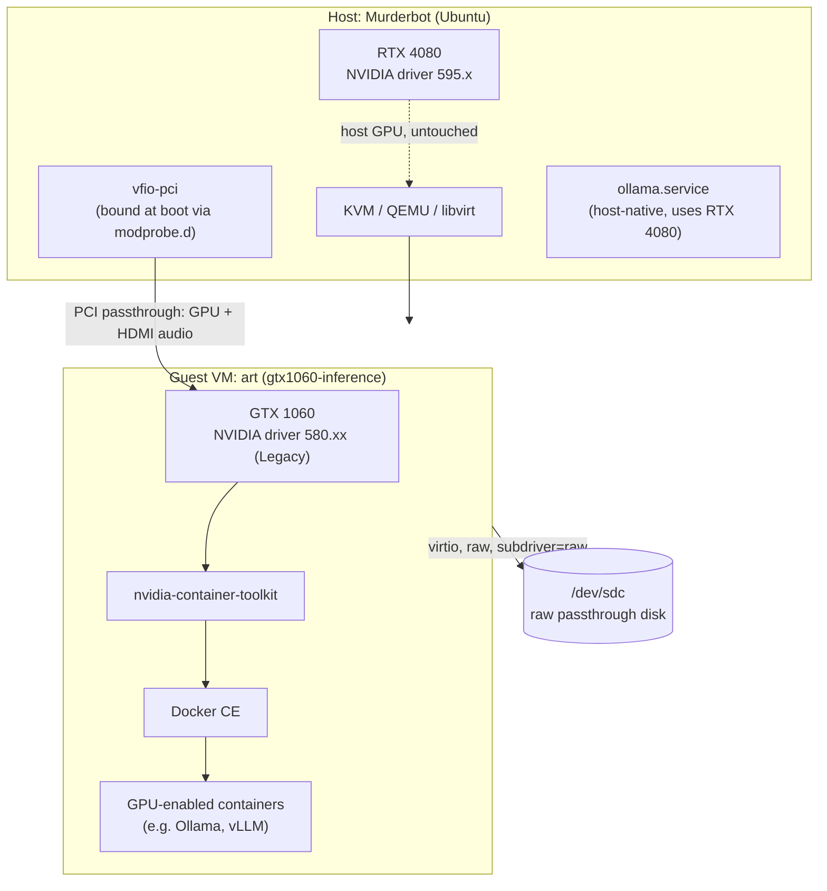

# Architecture

High-level view of how the host, the passthrough VM, and the two GPUs relate.
Full rationale for each piece lives in `docs/01-diagnosis.md` through
`docs/04-guest-driver-docker-gpu.md`.

## System Overview

One physical machine (`Murderbot`) hosts two GPUs that require two different,
mutually-incompatible NVIDIA driver branches. Rather than compromise on
driver branch or share a kernel driver across both cards, the second GPU
(GTX 1060) is passed through via VFIO to a dedicated VM (`art`), which runs
its own independent kernel and driver stack. Containerized inference
workloads run inside that VM against the 1060, isolated from the host's RTX
4080 and its driver.

## Component Diagram

## Data Flow

- **Host GPU path**: RTX 4080 stays bound to the host's normal NVIDIA driver
  (595.x) the entire time — untouched by anything in this repo. The host's
  own `ollama.service` uses it directly.
- **Passthrough GPU path**: the GTX 1060 (plus its HDMI audio function) is
  bound to `vfio-pci` at boot on the host, then handed to the `art` VM as a
  `<hostdev>` PCI device. Inside the guest, it's a normal PCI device to the
  580.xx Legacy driver — the guest has no awareness it's virtualized (see the
  `<kvm><hidden state='on'/></kvm>` hypervisor-hiding config in
  `docs/03-vm-provisioning.md`).
- **Inference workload path**: containers started with `docker run --gpus
  all` inside `art` reach the GTX 1060 through `nvidia-container-toolkit`,
  which wires up the guest's own NVIDIA driver/CUDA libraries into the
  container.

## Key Technologies

- **Host hypervisor**: KVM / QEMU / libvirt, UEFI (OVMF) guest firmware.
- **Passthrough**: VFIO (`vfio-pci`), Linux IOMMU (`intel_iommu=on
  iommu=pt`).
- **Guest OS**: Ubuntu Server, NVIDIA driver 580.xx (Legacy branch, Pascal
  support).
- **Container runtime**: Docker CE (apt, not snap) + `nvidia-container-toolkit`.

## Repository Structure

- `docs/`: Numbered narrative writeups (`01`–`06`) covering diagnosis
  through to two unrelated incidents found along the way, plus this
  Constitution-generated operational documentation.
- `configs/`: The actual config files referenced by the docs — host
  `modprobe.d`/GRUB/fstab/systemd files, and the full libvirt domain XML for
  the `art` VM.
- `constitution/`: Eric's Engineering Constitution (submodule) — universal
  engineering rules this repository follows.
