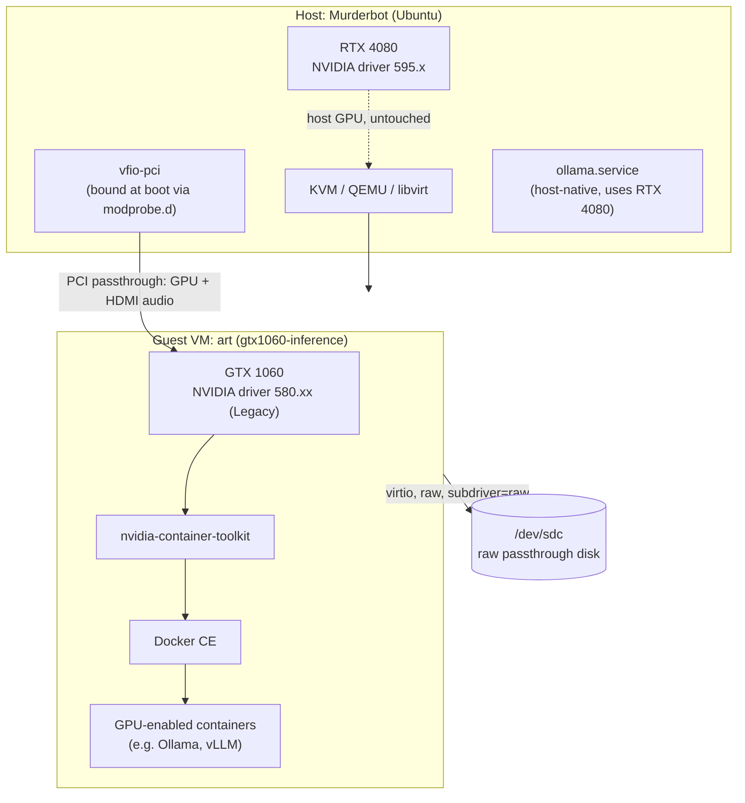

# Architecture

High-level view of how the host, the passthrough VM, and the two GPUs relate.
Full rationale for each piece lives in `docs/01-diagnosis.md` through
`docs/04-guest-driver-docker-gpu.md`.

## System Overview

One physical machine (`Murderbot`) hosts two GPUs that require two different,
mutually-incompatible NVIDIA driver branches. Rather than compromise on
driver branch or share a kernel driver across both cards, the second GPU
(GTX 1060) is passed through via VFIO to a dedicated VM (`art`), which runs
its own independent kernel and driver stack. Containerized inference
workloads run inside that VM against the 1060, isolated from the host's RTX
4080 and its driver.

## Component Diagram

## Data Flow

- **Host GPU path**: RTX 4080 stays bound to the host's normal NVIDIA driver
  (595.x) the entire time — untouched by anything in this repo. The host's
  own `ollama.service` uses it directly.
- **Passthrough GPU path**: the GTX 1060 (plus its HDMI audio function) is
  bound to `vfio-pci` at boot on the host, then handed to the `art` VM as a
  `<hostdev>` PCI device. Inside the guest, it's a normal PCI device to the
  580.xx Legacy driver — the guest has no awareness it's virtualized (see the
  `<kvm><hidden state='on'/></kvm>` hypervisor-hiding config in
  `docs/03-vm-provisioning.md`).
- **Inference workload path**: containers started with `docker run --gpus
  all` inside `art` reach the GTX 1060 through `nvidia-container-toolkit`,
  which wires up the guest's own NVIDIA driver/CUDA libraries into the
  container.

## Key Technologies

- **Host hypervisor**: KVM / QEMU / libvirt, UEFI (OVMF) guest firmware.
- **Passthrough**: VFIO (`vfio-pci`), Linux IOMMU (`intel_iommu=on
  iommu=pt`).
- **Guest OS**: Ubuntu Server, NVIDIA driver 580.xx (Legacy branch, Pascal
  support).
- **Container runtime**: Docker CE (apt, not snap) + `nvidia-container-toolkit`.

## System Boundaries

- **Host ↔ guest**: the only crossing point is the VFIO-passed-through PCI
  device (GTX 1060 + its HDMI audio function) and the raw block device
  (`/dev/sdc`). Everything else in the guest — its OS, driver, Docker,
  containers — is fully isolated from the host.
- **Guest ↔ network**: the `art` VM sits on libvirt's `default` NAT network
  (`192.168.122.0/24`), reachable via SSH from the host/LAN. It is not
  exposed beyond the local network.
- **Host GPU boundary**: the RTX 4080 and its driver are entirely outside
  this system's boundary — nothing here reads, writes, or depends on them.

## External Dependencies

- NVIDIA's driver repositories (`nvidia-driver-580` package and its Legacy
  branch, apt-installed in the guest).
- Docker's upstream apt repository (`download.docker.com`) and NVIDIA's
  `libnvidia-container` apt repository (`nvidia.github.io`) — both pinned to
  specific package versions at install time but not vendored; a future
  `apt install` inside the guest will pull whatever those repos currently
  serve.
- Container images pulled at verification time (for example
  `nvidia/cuda:12.6.0-base-ubuntu24.04`) come from Docker Hub / NVIDIA's
  registry, not something this repository controls or pins.

## Deployment Model

Single VM, single host, no orchestration layer. "Deploying" a change means
either editing the libvirt domain XML and `virsh define`-ing it (for VM
config) or SSHing into the guest and running commands directly (for guest
software). See `docs/OPERATIONS.md` for the full procedure and
`docs/SETUP.md` for provisioning from scratch.

## Operational Concerns

Deployment/rollback, monitoring, backup/restore, and incident response are
covered in full in [`docs/OPERATIONS.md`](OPERATIONS.md) rather than
duplicated here.

## Security-Sensitive Areas

- **Secure Boot is disabled in the guest.** A deliberate tradeoff, not an
  oversight — see
  [`docs/adr/0002-disable-secure-boot-in-guest.md`](adr/0002-disable-secure-boot-in-guest.md).
  The guest now loads kernel modules without signature verification.
- **Passwordless sudo in the guest**
  (`/etc/sudoers.d/90-esanacore-nopasswd`), added specifically to allow
  non-interactive SSH automation. Acceptable given the guest is a
  single-operator, internal-only VM; would need revisiting before any
  multi-user or externally-reachable use.
- **Raw block device passthrough** (`/dev/sdc`): the host kernel can still
  see and probe this device's partition table even while the VM holds it as
  its exclusive backing store. Nothing on the host should ever `mount` it
  while the VM is running — see the caution in
  [`docs/03-vm-provisioning.md`](03-vm-provisioning.md). This is a data
  integrity concern more than a confidentiality one, but it's the single
  easiest way to silently corrupt the guest.
- **No secrets are stored in this repository.** SSH access uses key-based
  auth (the host's existing key, already registered on GitHub); no
  passwords, tokens, or credentials appear in any committed file. See
  `SECURITY.md`.

## Repository Structure

- `docs/`: Numbered narrative writeups (`01`–`06`) covering diagnosis
  through to two unrelated incidents found along the way, `adr/` for
  architecture decisions, plus this Constitution-generated operational
  documentation.
- `configs/`: The actual config files referenced by the docs — host
  `modprobe.d`/GRUB/fstab/systemd files, and the full libvirt domain XML for
  the `art` VM.
- `scripts/`: Drift-detection and end-to-end verification tooling (see
  `scripts/README.md`) — the closest thing this repository has to automated
  tests.
- `assets/diagrams/`: Mermaid source and rendered SVG for the README's hero
  diagram.
- `constitution/`: Eric's Engineering Constitution (submodule) — universal
  engineering rules this repository follows.
